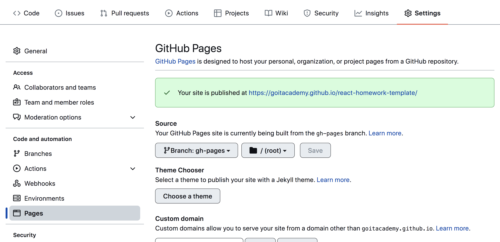

# Parcel template

Цей проект створено за допомогою Parcel. Для ознайомлення та налаштування
додаткових можливостей, [зверніться до документації](https://parceljs.org/).

## Підготовка нового проекту

1. Переконайтеся, що на вашому комп'ютері встановлена LTS-версія Node.js.
   [Завантажте та встановіть](https://nodejs.org/en/) якщо потрібно.
2. Клонуйте цей репозиторій.
3. Змініть ім'я папки з `parcel-project-template` на ім'я свого проекту.
4. Створіть новий порожній репозиторій на GitHub.
5. Відкрийте проект в VSCode, запустіть термінал і пов'яжіть проект з
   GitHub-репозиторієм
   [за інструкцією](https://docs.github.com/en/get-started/getting-started-with-git/managing-remote-repositories#changing-a-remote-repositorys-url).
6. Встановіть залежності проекту в терміналі командою `npm install` .
7. Запустіть режим розробки, виконавши команду `npm start`.
8. Перейдіть у браузері за адресою
   [http://localhost:1234](http://localhost:1234). Ця сторінка автоматично
   оновлюватиметься після збереження змін у файлах проекту.

## Файли та папки

- Всі стилізовані файли повинні знаходитися у папці `src/sass` і імпортуватися в
  файли стилів сторінок. Наприклад, для `index.html` файл стилів називається
  `index.scss`.
- Зображення додавайте у папку `src/images`. Збірник їх оптимізує, але лише під
  час розгортання продакшн-версії проекту. Все це відбувається в хмарі, щоб не
  навантажувати ваш комп'ютер, оскільки на слабших машинах це може зайняти
  багато часу.

## Розгортання

Для налаштування розгортання проекту потрібно виконати кілька додаткових кроків
щодо налаштування вашого репозиторію. Перейдіть на вкладку `Settings` і у
підсекції `Actions` виберіть `General`.


Прокрутіть сторінку до останньої секції, переконайтеся, що вибрані параметри
так, як показано на наступному зображенні, і натисніть `Save`. Без цих
налаштувань сборці не вистачить прав для автоматизації процесу розгортання.


Продакшн-версія проекту автоматично збирається та розгортається на GitHub Pages
у гілку `gh-pages` кожного разу, коли оновлюється гілка `main`. Наприклад, після
прямого пуша або після прийняття запиту на витягування. Для цього необхідно в
файлі `package.json` змінити поле homepage та скрипт `build`, замінивши
`your_username` та `your_repo_name` на свої дані, та відправити зміни на GitHub.

```json
"homepage": "https://your_username.github.io/your_repo_name/",
"scripts": {
  "build": "parcel build src/*.html --public-url /your_repo_name/"
},
```

Потім вам потрібно зайти в налаштування репозиторія GitHub (`Settings` >
`Pages`) та вказати розповсюдження файлів продакшн версії з папки `/root` гілки
`gh-pages`, якщо це не було зроблено автоматично.



### Статус розгортання

Статус останнього коміту розгортання відображається піктограмою біля його
ідентифікатора.

- **Жовтий колір** - триває збірка та розгортання проекту.
- **Зелений колір** - розгортання завершилося успішно.
- **Червоний колір** - під час лінтінгу, збірки або розгортання сталася помилка.

Докладну інформацію про статус можна подивитися, клацнувши на піктограму і
перейшовши за посиланням `Details` у спливаючому вікні.


### Жива сторінка

Зазвичай через кілька хвилин живу сторінку можна буде переглянути за адресою,
яку ви вказали у властивості `homepage`. Наприклад, ось посилання на живу версію
для цього репозиторію:
[https://goitacademy.github.io/parcel-project-template](https://goitacademy.github.io/parcel-project-template).

Якщо відкривається порожня сторінка, переконайтеся, що у вкладці `Console` немає
помилок, пов'язаних з неправильними шляхами до файлів CSS та JS проекту
(**404**). Ймовірно, у вас неправильне значення властивості `homepage` або
скрипта `build` у файлі `package.json`.

## Як це працює


1. Після кожного натискання на `main` репозиторій GitHub спеціальний скрипт
   (GitHub Action) запускається з файлу `.github/workflows/deploy.yml`.
2. Усі файли репозиторію копіюються на сервері, де проект ініціалізується та
   проходить збірку перед деплоєм.
3. Якщо всі етапи успішно пройдені, зібрана продакшн версія файлів проекту
   надсилається до гілки `gh-pages`. У випадку невдачі, причина буде вказана в
   журналі виконання скрипта.

---

Завдання 1 - бібліотека SimpleLightbox Виконуй це завдання у файлах
01-gallery.html і 01-gallery.js. Розбий його на декілька підзавдань:

Додай бібліотеку SimpleLightbox як залежність проекту, використовуючи npm
(посилання на CDN з твоєї минулої роботи більше не потрібне). Використовуй свій
JavaScript код з попередньої домашньої роботи, але виконай рефакторинг з
урахуванням того, що бібліотека була встановлена через npm (синтаксис
import/export). Для того щоб підключити CSS код бібліотеки в проект, необхідно
додати ще один імпорт, крім того, що описаний в документації.

// Описаний в документації import SimpleLightbox from "simplelightbox"; //
Додатковий імпорт стилів import "simplelightbox/dist/simple-lightbox.min.css";

---

Завдання 2 - відеоплеєр HTML містить <iframe> з відео для Vimeo плеєра. Напиши
скрипт, який буде зберігати поточний час відтворення відео у локальне сховище і,
після перезавантаження сторінки, продовжувати відтворювати відео з цього часу.

<iframe
  id="vimeo-player"
  src="https://player.vimeo.com/video/236203659"
  width="640"
  height="360"
  frameborder="0"
  allowfullscreen
  allow="autoplay; encrypted-media"
></iframe>

Виконуй це завдання у файлах 02-video.html і 02-video.js. Розбий його на
декілька підзавдань:

Ознайомся з документацією бібліотеки Vimeo плеєра. Додай бібліотеку як
залежність проекту через npm. Ініціалізуй плеєр у файлі скрипта як це описано в
секції pre-existing player, але враховуй, що у тебе плеєр доданий як npm пакет,
а не через CDN. Вивчи документацію методу on() і почни відстежувати подію
timeupdate - оновлення часу відтворення. Зберігай час відтворення у локальне
сховище. Нехай ключем для сховища буде рядок "videoplayer-current-time". Під час
перезавантаження сторінки скористайся методом setCurrentTime() з метою
відновлення відтворення зі збереженої позиції. Додай до проекту бібліотеку
lodash.throttle і зроби так, щоб час відтворення оновлювався у сховищі не
частіше, ніж раз на секунду.

---

Завдання 3 - форма зворотного зв'язку HTML містить розмітку форми. Напиши
скрипт, який буде зберігати значення полів у локальне сховище, коли користувач
щось друкує.

<form class="feedback-form" autocomplete="off">
  <label>
    Email
    <input type="email" name="email" autofocus />
  </label>
  <label>
    Message
    <textarea name="message" rows="8"></textarea>
  </label>
  <button type="submit">Submit</button>
</form>

Виконуй це завдання у файлах 03-feedback.html і 03-feedback.js. Розбий його на
декілька підзавдань:

Відстежуй на формі подію input, і щоразу записуй у локальне сховище об'єкт з
полями email і message, у яких зберігай поточні значення полів форми. Нехай
ключем для сховища буде рядок "feedback-form-state". Під час завантаження
сторінки перевіряй стан сховища, і якщо там є збережені дані, заповнюй ними поля
форми. В іншому випадку поля повинні бути порожніми. Під час сабміту форми
очищуй сховище і поля форми, а також виводь у консоль об'єкт з полями email,
message та їхніми поточними значеннями. Зроби так, щоб сховище оновлювалось не
частіше, ніж раз на 500 мілісекунд. Для цього додай до проекту і використовуй
бібліотеку lodash.throttle.
